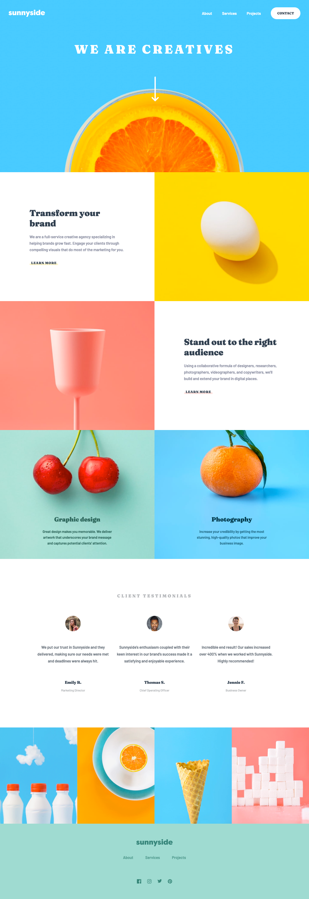

# Frontend Mentor - Sunnyside agency landing page solution

This is a solution to the [Sunnyside agency landing page challenge on Frontend Mentor](https://www.frontendmentor.io/challenges/sunnyside-agency-landing-page-7yVs3B6ef). Frontend Mentor challenges help you improve your coding skills by building realistic projects.

## Table of contents

- [Overview](#overview)
  - [The challenge](#the-challenge)
  - [Screenshot](#screenshot)
  - [Links](#links)
- [My process](#my-process)
  - [Built with](#built-with)
  - [Steps](#steps)
  - [Continued development](#continued-development)

## Overview

### The challenge

Users should be able to:

- View the optimal layout for the site depending on their device's screen size
- See hover states for all interactive elements on the page

### Screenshot

### Links

- Solution URL: [https://github.com/zakhi/sunnyside-agency-landing-page-main](https://github.com/zakhi/sunnyside-agency-landing-page-main)
- Live Site URL: [https://zakhi.github.io/sunnyside-agency-landing-page-main/](https://zakhi.github.io/sunnyside-agency-landing-page-main/)

## My process

### Built with

- Semantic HTML5 markup
- CSS Grid
- Flexbox
- Mobile-first workflow

### Steps

My first step was to create a mobile design, and then use a media query to adapt to desktop.

After that, I tried to accomplish two things:
1. Improve the organization of the CSS
2. Make the design truly responsive, adapting to different resolutions.

### Continued development

* I want to do a fully responsive design from the start.
* Uae Sass mainly for code organization.
